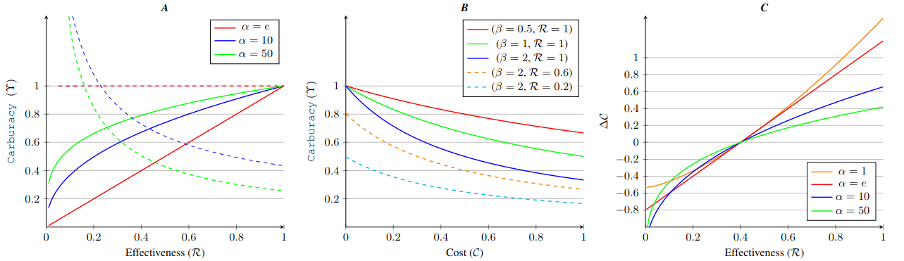
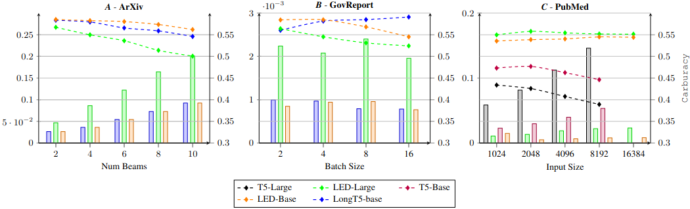
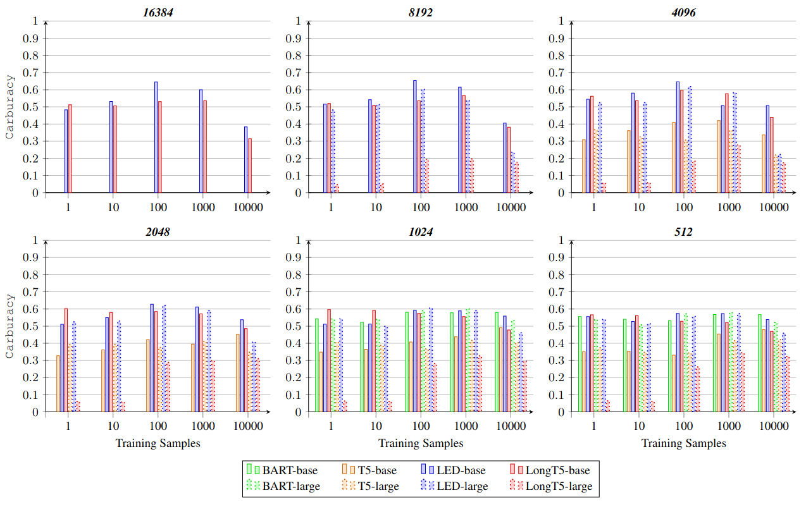

# Carburacy

The **Carbon-Aware Accuracy**. This metric combines performances and carbon footprint in a unique score to evaluate the environmental impact of your models. 
We also propose an expansive analysis and comparison of long document summarization models under several settings to evaluate which is the greener setting.
All the metric specifics and the LDS comparison findigs are in the original paper [Link](link), published as **long articles** in *AAAI23*.

>Current generative transformer-based models have achieved state-of-the-art performance in long document summarization.
However, this task witnessed a paradigm shift in developing ever-increasingly computationally-hungry models, focusing on effectiveness while ignoring the economic, environmental, and social costs of producing such results.
Furthermore, the extensive resources such models require to obtain state-of-the-art scores impact climate change and raise barriers to small and medium organizations characterized by low-resource regimes of hardware and data.
This unsustainable trend has lifted many concerns in the community, proposing tools to monitor models' energy cost and carbon footprint.
Despite their importance, no evaluation measures considering models' eco-sustainability exist yet.
In this paper, we propose *Carburacy*, the first carbon-aware accuracy measure that captures both model effectiveness and eco-sustainability.
We perform an extensive benchmark for long document summarization, comparing multiple state-of-the-art quadratic and linear transformers on several datasets under eco-sustainable regimes.
Finally, thanks to *Carburacy*, we found optimal combinations of hyperparameters that let models be competitive in effectiveness with significantly lower costs. - *Paper's Abstract*

## The metric Carburacy 

The metric formulation is....
<p align="center">
  
</p>

## The Long Document Models comparision

<p align="center">
  
</p>

Comparision of several models on Arxiv dataset

<p align="center">
  
</p>

Comparision of several SOTA summarization models using carburacy to asses their tradeoff between performances and costs.

## How to use

```
from carburacy import Carburacy
carb = Carburacy(performance_score, carbon_footprint, performance_metric='rouge')
print(f'The Carburacy of your model is {carb}')
```

**the code will be available soon**

